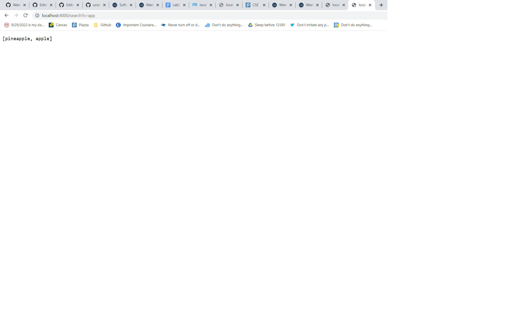
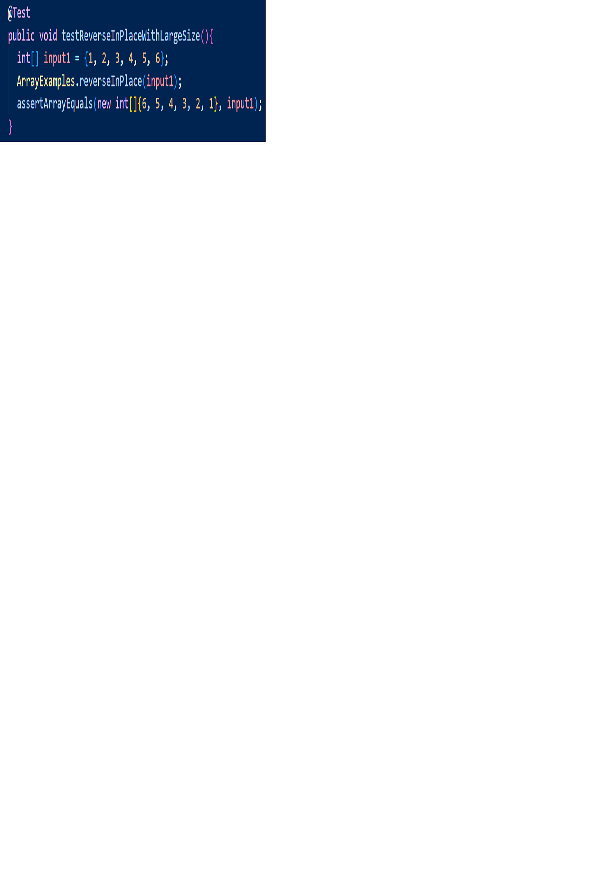
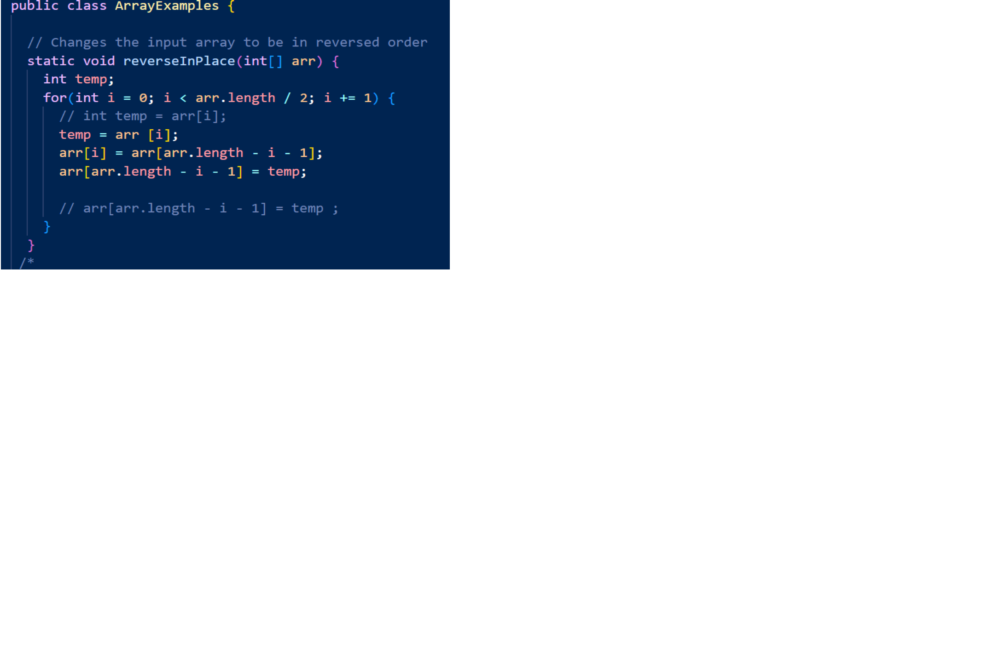
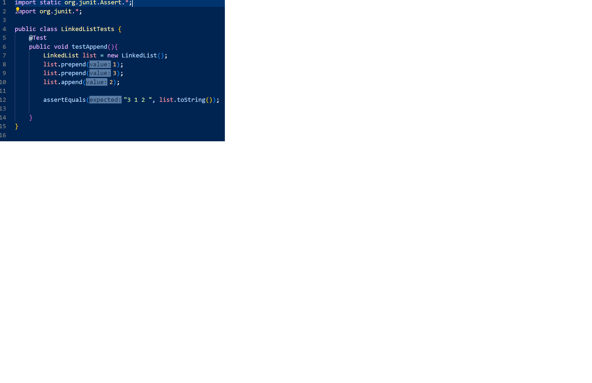
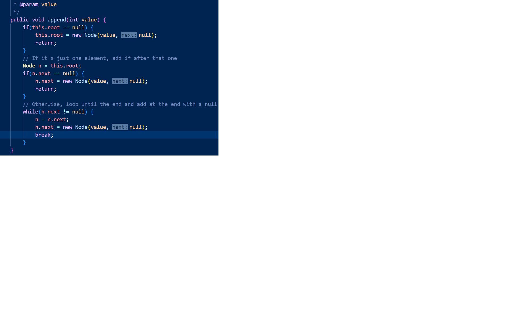

#  Week 3 Lab 
*Acknowledgement: Thanks to Beng Ngyuen, my group member in every lab session, who helped me find the bug of append() method in LinkedListExample.java file.*

<br>

 Hi there! This is Bowen. Welcome to week 3's lab report. Today's report consists of two parts: 

**Part 1**: Show the code for my Simplest Search Engine from last week (week 2), attach three screenshots of my search engine performing add and query methods, and explain engine's behaviors.  

**Part 2**: Choose and explain two different bugs in this week's lab files.

## Now, that's get started!

<br>

## [**Part 1**](*)
### First of all, I'll show you the code in my SearchEngine.java file:

```
import java.io.IOException;
import java.net.URI;
import java.util.ArrayList;

class Handler implements URLHandler{
   ArrayList<String> list = new ArrayList<>();
   int num = 0; 
   public String handleRequest(URI url){
        if (url.getPath().equals("/")) {
            return String.format("Number: %d", num);
        } else if (url.getPath().equals("/increment")) {
            num += 1;
            return String.format("Number incremented!");
        } else {
            System.out.println("Path: " + url.getPath());
            if (url.getPath().contains("/add")) {
                String[] parameters = url.getQuery().split("=");
                if(parameters[0].equals("s")) {
                    list.add(parameters[1]);
                    for (String s: list){
                        return list.toString();
                    }
                    
                }  
            }
            else if (url.getPath().contains("/search"));
            String[] parameters = url.getQuery().split("=");
            if(parameters[0].equals("s")) {
                ArrayList<String> newList = new ArrayList<>();

                for (String s: list){
                    if (s.contains(parameters[1])){
                      newList.add(s);                      
                    }                   
                }
                return newList.toString(); 

            }
            return "404 Not Found!";  
    }
}
}
class SearchEngine {
public static void main (String[] args) throws IOException{
    int port = Integer.parseInt(args[0]);
    if (args.length == 0){
        System.out.println("Missing port number! Try any number between 1024 to 49151.");
        return;
    }
    Server.start(port,  new Handler());
    }
}
```

<br>

### After compiling the code below in the terminal in the following way, I am able to obtain the original link (http://localhost:4000) to the search enginee I just created.
```
javac Server.java SearchEngine.java
java SearchEngine.java
Server Started! Visit http://localhost:4000
```

<br>

### After all these steps, it's the time to apply adding and querying via "manipulating" the search engine link's path. Here're three screenshots of adding and querying. I'll also explain these behaviors below each screenshot based on 
### 1. Which methods in my code are called; 
### 2. What the values of the relevant arguments to those methods are, and the values of any relevant fields of the class; 
### 3. If those values change, how they change by the time the request is done processing

<br>

### **Screenshot 1:**


<br>

### ***Explanation:*** 
### 1. Methods called: contains(), getQuery(), split(), equals(), add(), toString()
### 2. Values of relevant arguments and fields: 
* ### contains(): "/add" 
* ### getQuery(): http://localhost:4000/add?=pineapple 
* ### split(): "="
* ### equals(): "s"
* ### add(): "pinapple"
* ### toString(): ["pineapple"] 
* ### list: ["pineapple"]

### 3. changed values: 
* ### add() -  new value
* ### toString - ["pineapple", new value]
* ### list - ["pineapple", new value]  
* ### getQuery(): http://localhost:4000/add?=new value
* ### Other methods/values remain unchanged

### **Screenshot 2:**


<br>

### ***Explanation:*** 
### 1. Methods called: contains(), getQuery(), split(), equals(), add(), toString()
### 2. Values of relevant arguments and fields: 
* ### contains(): "/add" 
* ### getQuery(): http://localhost:4000/add?=apple 
* ### split(): "="
* ### equals(): "s"
* ### add(): "pinapple"
* ### toString(): ["pineapple", "apple"] 
* ### list: ["pineapple", "apple"]

### 3. changed values: 
* ### add() -  new value
* ### toString - ["pineapple", "apple", new value]
* ### list - ["pineapple", "apple", new value]  
* ### getQuery(): http://localhost:4000/add?=new value
* ### Other methods/values remain unchanged

### **Screenshot 2:**


<br>

### ***Explanation:*** 
### 1. Methods called: contains(), getQuery(), split(), equals(), add(), toString()
### 2. Values of relevant arguments and fields: 
* ### contains(): "/search", "apple" 
* ### getQuery(): http://localhost:4000/search?=apple 
* ### split(): "="
* ### equals(): "s"
* ### add(): "pinapple", "apple" 
* ### toString(): ["pineapple", "apple"] 
* ### list: ["pineapple", "apple"]

### 3. changed values: 
* ### add() -  existing elements in the ArrayList that contains parameters[1]
* ### toString - [existing elements in the ArrayList that contains parameters[1]]
* ### list - [existing elements in the ArrayList that contains parameters[1]]  
* ### getQuery(): http://localhost:4000/add?=new value
* ### Other methods/values remain unchanged

<br>

## ***End of Part 1***

<br>

## [**Part 2**](*)
### This part, I'm gonna show you two bugs I've spotted in two different files assigned during Thursday's lab. In more detail, I'll show you: 


 ### 1. The failure-inducing input (the code of the test)The symptom (the failing test output)


 ### 2. The bug (the code fix needed) 


 ### 3. Then, explain the connection between the symptom and the bug. Why does the bug cause that particular symptom for that particular input?


### Are you excited? Now, let's get stared!

<br>

<h2 style="color:red;">Bug 1 (located inside ArrayExamples.java file, reverseInPlace(int[] arr) method):</h2>

<br>


## Screenshots of my test case as well as testing result:



<br>

## Bug fixed:


<br>

### ***Explanation:***
### 1. The failure-inducing input: {1, 2, 3, 4, 5, 6};
### 2. Bug: the method only updates arr[i] to arr[arr.length - i - 1] but fails to update arr[arr.length - i - 1] to the original value of arr[i]
### 3. Symptom: [6, 5, 4, 4 ,5, 6]
### 4. Connection between the bug and the symptom: when this method updates the value arr[i] to arr[arr.length - i - 1], it only changes the value of arr[i] but not the value of [arr.length - i - 1]. As a result, when the for loop loops through the second half of the array, all values have been changed and it will return an array with symmetric values of elements. If it's unclear, we can also see the following logic flow of this buggy method:   
```
  * input array = [1, 2, 3, 4, 5, 6]:
Iteration 1: i = 0; arr[0] = arr[5], arr = [6, 2, 3, 4, 5, 6]
Iteration 2: i = 1; arr[1] = arr[4], arr = [6, 5, 3, 4, 5, 6]
Iteration 3: i = 2; arr[2] = arr[3], arr = [6, 5, 4, 4 ,5, 6]
Iteration 4: i = 3; arr[3] = arr[2], arr = [6, 5, 4, 4 ,5, 6]
Iteration 5: i = 4; arr[4] = arr[1], arr = [6, 5, 4, 4 ,5, 6]
Iteration 6: i = 5; arr[5] = arr[0], arr = [6, 5, 4, 4 ,5, 6]
  * end of the loop  
```

<br>

<h2 style="color:red;">Bug 2 (located inside LinkedListExample.java file, append() method):</h2>

<br>

## Screenshots of my test case:



<br>

## Bug fixed (add a break statement at the end of the while loop):


### ***Explanation:***
### 1. The failure-inducing input: 3, 1, 2;
### 2. Bug: in the while loop, as it loops to the end of a linkedlist, it doesn't update the value of its end node to be null. 
### 3. Symptom: an infinite while loop occurred
### 4. Connection between the bug and the symptom: in the while loop, as it loops to the end of a linkedlist, it doesn't update the value of its end node to be null. Therefore, the while loop keeps going, and we need to add a break statement at the end of it to fix this bug.   

<br>

## ***That's the end of today's lab report.***
## ***See you in two weeks :)***